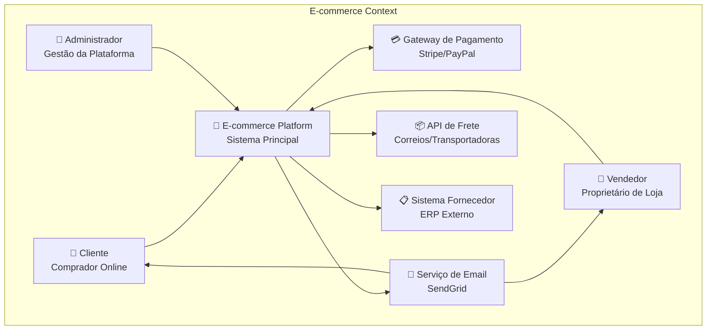
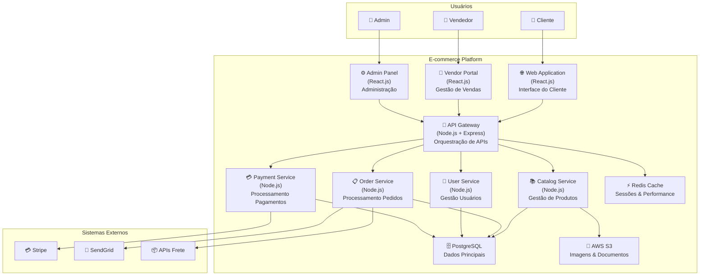
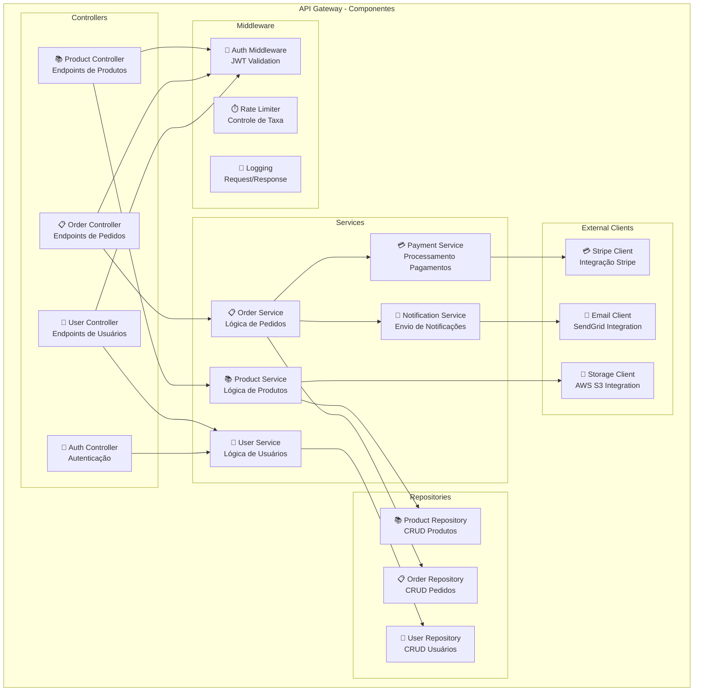

# Exemplo de Saída do C4 Generator

## Sistema: E-commerce Platform

### Context Level (Nível 1)



### Container Level (Nível 2)



### Component Level (Nível 3)



## Vantagens desta Saída

### ✅ **Context Level**
- **Audiência:** Executivos, stakeholders
- **Foco:** Visão de negócio
- **Clareza:** Mostra "o que" o sistema faz

### ✅ **Container Level** 
- **Audiência:** Arquitetos, tech leads
- **Foco:** Tecnologias e infraestrutura
- **Clareza:** Mostra "como" o sistema está estruturado

### ✅ **Component Level**
- **Audiência:** Desenvolvedores
- **Foco:** Organização interna do código
- **Clareza:** Mostra "onde" implementar funcionalidades

## Como Gerar Este Exemplo

```bash
# 1. Clone o projeto
git clone <repo>
cd c4-generator

# 2. Instale dependências
npm install

# 3. Configure API Key
cp env.example .env
# Edite .env com sua OPENAI_API_KEY

# 4. Execute o gerador
npm start

# Responda as perguntas:
# Nome: E-commerce Platform
# Descrição: Sistema de vendas online...
# Tecnologias: React.js, Node.js, PostgreSQL, Redis
# Níveis: Context, Container, Component
# Formato: Mermaid
```

## Visualizar Diagramas

1. **Copie o código Mermaid**
2. **Acesse:** https://mermaid.live/
3. **Cole e visualize**

---

*Gerado automaticamente com C4 Generator + OpenAI GPT* 