# Exemplo de Saída do C4 Generator

## Sistema: E-commerce Platform

### Context Level (Nível 1)

```mermaid
graph TB
    subgraph "E-commerce Context"
        Customer["👤 Cliente<br/>Comprador Online"]
        Admin["👤 Administrador<br/>Gestão da Plataforma"]
        Vendor["👤 Vendedor<br/>Proprietário de Loja"]
        
        EcommercePlatform["🛒 E-commerce Platform<br/>Sistema Principal"]
        
        PaymentGateway["💳 Gateway de Pagamento<br/>Stripe/PayPal"]
        EmailService["📧 Serviço de Email<br/>SendGrid"]
        ShippingAPI["📦 API de Frete<br/>Correios/Transportadoras"]
        InventorySupplier["📋 Sistema Fornecedor<br/>ERP Externo"]
        
        Customer --> EcommercePlatform
        Admin --> EcommercePlatform
        Vendor --> EcommercePlatform
        
        EcommercePlatform --> PaymentGateway
        EcommercePlatform --> EmailService
        EcommercePlatform --> ShippingAPI
        EcommercePlatform --> InventorySupplier
        
        EmailService --> Customer
        EmailService --> Vendor
    end
```



### Container Level (Nível 2)


### Component Level (Nível 3)

```mermaid
graph TB
    subgraph "API Gateway - Componentes"
        subgraph "Controllers"
            ProductController["📚 Product Controller<br/>Endpoints de Produtos"]
            OrderController["📋 Order Controller<br/>Endpoints de Pedidos"]
            UserController["👤 User Controller<br/>Endpoints de Usuários"]
            AuthController["🔐 Auth Controller<br/>Autenticação"]
        end
        
        subgraph "Middleware"
            AuthMiddleware["🔐 Auth Middleware<br/>JWT Validation"]
            RateLimiter["⏱️ Rate Limiter<br/>Controle de Taxa"]
            LoggingMiddleware["📝 Logging<br/>Request/Response"]
        end
        
        subgraph "Services"
            ProductService["📚 Product Service<br/>Lógica de Produtos"]
            OrderService["📋 Order Service<br/>Lógica de Pedidos"]
            UserService["👤 User Service<br/>Lógica de Usuários"]
            PaymentService["💳 Payment Service<br/>Processamento Pagamentos"]
            NotificationService["🔔 Notification Service<br/>Envio de Notificações"]
        end
        
        subgraph "Repositories"
            ProductRepository["📚 Product Repository<br/>CRUD Produtos"]
            OrderRepository["📋 Order Repository<br/>CRUD Pedidos"]
            UserRepository["👤 User Repository<br/>CRUD Usuários"]
        end
        
        subgraph "External Clients"
            StripeClient["💳 Stripe Client<br/>Integração Stripe"]
            EmailClient["📧 Email Client<br/>SendGrid Integration"]
            StorageClient["📁 Storage Client<br/>AWS S3 Integration"]
        end
    end
    
    ProductController --> AuthMiddleware
    OrderController --> AuthMiddleware
    UserController --> AuthMiddleware
    
    ProductController --> ProductService
    OrderController --> OrderService
    UserController --> UserService
    AuthController --> UserService
    
    ProductService --> ProductRepository
    OrderService --> OrderRepository
    OrderService --> PaymentService
    OrderService --> NotificationService
    UserService --> UserRepository
    
    PaymentService --> StripeClient
    NotificationService --> EmailClient
    ProductService --> StorageClient
```



## Vantagens desta Saída

### ✅ **Context Level**
- **Audiência:** Executivos, stakeholders
- **Foco:** Visão de negócio
- **Clareza:** Mostra "o que" o sistema faz

### ✅ **Container Level** 
- **Audiência:** Arquitetos, tech leads
- **Foco:** Tecnologias e infraestrutura
- **Clareza:** Mostra "como" o sistema está estruturado

### ✅ **Component Level**
- **Audiência:** Desenvolvedores
- **Foco:** Organização interna do código
- **Clareza:** Mostra "onde" implementar funcionalidades

## Como Gerar Este Exemplo

```bash
# 1. Clone o projeto
git clone <repo>
cd c4-generator

# 2. Instale dependências
npm install

# 3. Configure API Key
cp env.example .env
# Edite .env com sua OPENAI_API_KEY

# 4. Execute o gerador
npm start

# Responda as perguntas:
# Nome: E-commerce Platform
# Descrição: Sistema de vendas online...
# Tecnologias: React.js, Node.js, PostgreSQL, Redis
# Níveis: Context, Container, Component
# Formato: Mermaid
```

## Visualizar Diagramas

1. **Copie o código Mermaid**
2. **Acesse:** https://mermaid.live/
3. **Cole e visualize**

---

*Gerado automaticamente com C4 Generator + OpenAI GPT* 